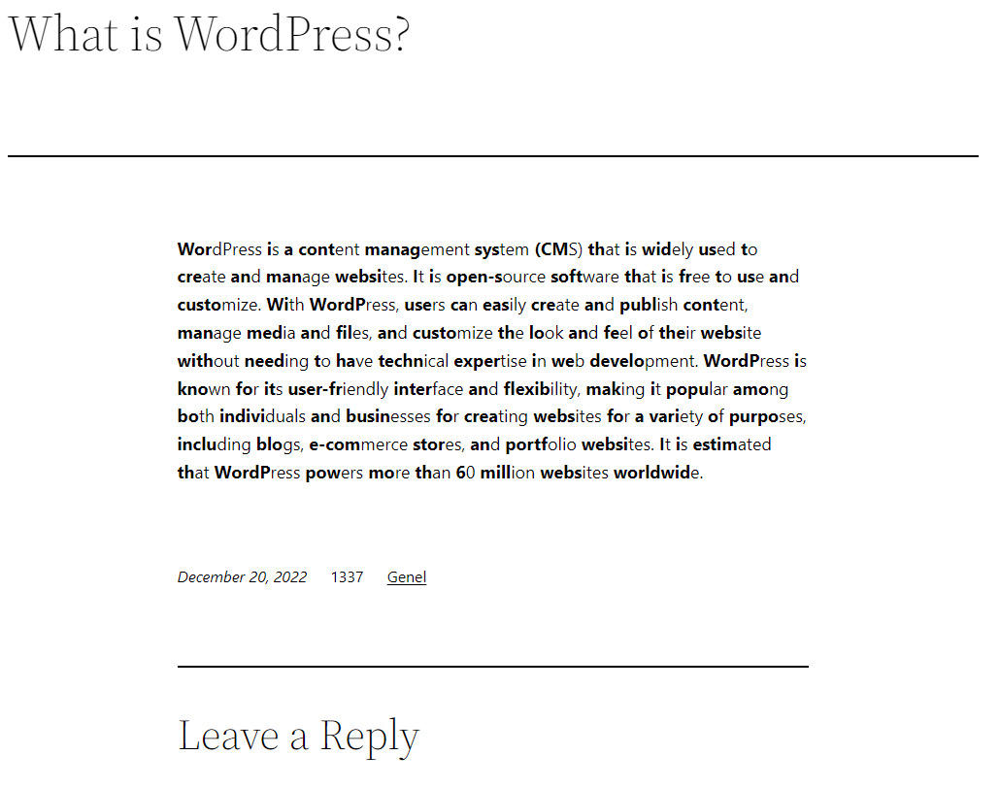
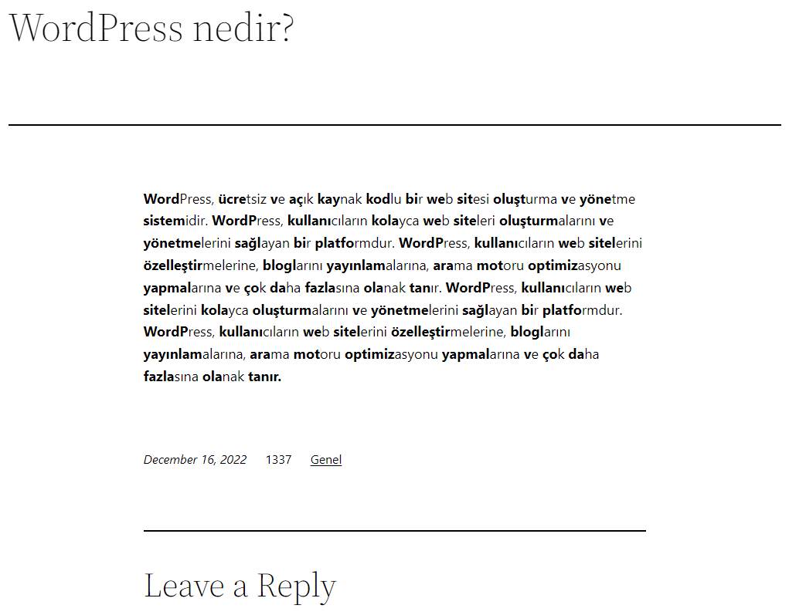

# What is Bionic Reading?
Bionic Reading is a new method that, through the simplest tweak, can dramatically boost your reading speed. At the same time, it may also assist in comprehension and recollection due to how our brain works.
More Information: https://bionic-reading.com

# Bionic Reading Wordpress Plugin

# EN
This plugin applies the Bionic Reading format to all blog posts on your site.
<h2>Installation:</h2> 
<b>1-)</b> Download the Bionic Reading Wordpress Plugin. 
<b>2-)</b> Install the plugin on WordPress. 
<b>3-)</b> Activate plugin.  

# Images
 

The plugin is continuously being developed, you can use the following links for communication and support.

# Biyonik Okuma nedir?
Biyonik Okuma, dikkati kelimenin ilk birkaç harfine veya hecesine çekerek okumayı kolaylaştıran ve hızlandıran yeni bir yöntemdir. Okuyucu yalnızca kelimelerin vurgulanan harflerine veya hecelerine odaklanırken, insan beyni kelimenin geri kalanını tamamlar. Böylece okuma hızı artarken, okunan metin daha kolay anlaşılır. Sığ okuma biçimlerinin hakim olduğu bir dünyada Biyonik Okuma, yazılı içeriğin daha derinlemesine okunmasını ve anlaşılmasını teşvik etmeyi amaçlar.
Daha fazla bilgi için: https://biyonikokuma.com/

# TR
Bu WordPress eklentisi,sitedeki tüm blog yazılarına Biyonik Okuma formatını uygular.
<h2>Kurulum:</h2> 
<b>1-)</b>  Bionic Reading Wordpress eklentisini indirin. 
<b>2-)</b> Wordpress'e eklentiyi yükleyin. 
<b>3-)</b> Eklentiyi aktif edin ve kullanmaya başlayın. 

# Ekran Görüntüleri
 

Eklenti üzerinde geliştirmeler devam ediyor, iletişim ve destek için aşağıdaki bağlantıları kullanabilirsiniz.

<h2>Buy me a coffee: </h2>
https://www.buymeacoffee.com/huseyintintas

<h2>Contact: </h2>
mail@huseyintintas.com 
https://twitter.com/1337stif
